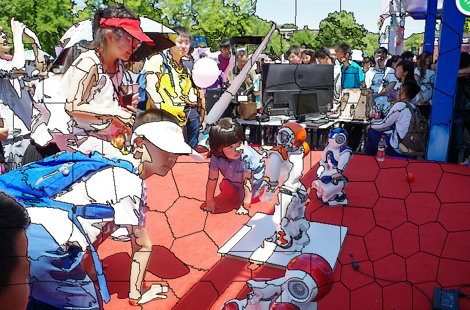

## SLIC原理简介及VLFeat代码示例  
1. 原理  

SLIC，即简单线性迭代聚类，是一种简单有效的图像分割方法，其本质是局部空间的K-means聚类。

2. 方法：  

1）给定超像素个数，初始化聚类中心（按照regionSize均匀分割为grid tile，一般选取grid tile的中心为聚类中心）； 
2）将初始聚类中心在其n×n邻域内微调（一般n=3即可），将聚类中心移到邻域内梯度最小的地方，这样是为了防止聚类中心落在边界上； 
3）每个grid tile（regionSize×regionSize的方格）内根据各点到聚类中心的距离进行K-means聚类； 
4）计算新的聚类中心与之前聚类中心的L1距离，根据阈值判断算法是否收敛。

3. VLFeat之vl_slic

MATLAB API：SLIC详细介绍参见VLFeat官网

SEGMENTS = VL_SLIC(IM, REGIONSIZE, REGULARIZER) 
参数： 
IM： Input image， SINGLE array with two or three dimensions. The third dimension is arbitrary, but it is usually three for RGB or LAB images 
REGIONSIZE ：is the starting size of the superpixels； 
REGULARIZER： is the trades-off appearance for spatial regularity when clustering (a larger value results in more spatial regularization). 
SEGMENTS is a UINT32 array containing the superpixel identifier for each image pixel.
示例：代码引自：http://blog.csdn.net/yeyang911/article/details/39156817
```matlab
function slicTest( IMG ,SIZE,RATE)

I =  vl_rgb2xyz(imread(IMG));
II =  (imread(IMG));
im=II;
size(im)

I_single = single(I);
segments = vl_slic(I_single, SIZE, RATE) ;
[sx,sy]=vl_grad(double(segments), 'type', 'forward') ;
s = find(sx | sy) ;
size(find(sx | sy))
imp = II ;
imp([s s+numel(im(:,:,1)) s+2*numel(im(:,:,1))]) = 0 ;

o = imp;
imshow(o);

end
```
运行结果： 

