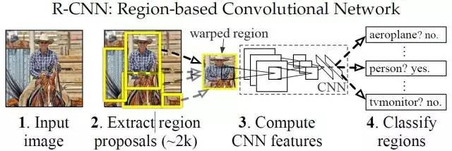
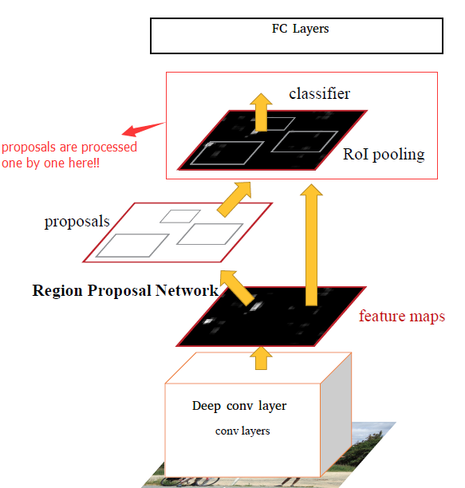
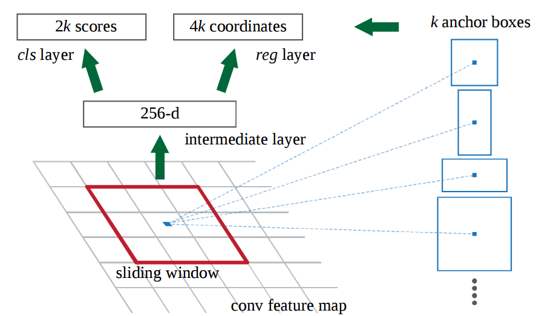

## 机器视觉目标检测补习贴之R-CNN系列 — R-CNN, Fast R-CNN, Faster R-CNN  
  
  ### 初识目标检测领域，当然先要了解下面这些框架：  
* RCNN  
* Fast RCNN  
* Faster RCNN  
* Yolo  
* SSD  

什么是目标检测？  
> 
  
  把存在的目标从图片中找出来，就是那么简单！
  
在计算机中，传统目标检测方法大致分为如下三步：区域选择，特征提取，分类器分类。  
首先在给定的图像上选择一些候选的区域，然后对这些区域提取特征，最后使用训练的分类器进行分类。下面我们对这三个阶段分别进行介绍。
  
(1) 区域选择  
  
这一步是为了对目标的位置进行定位。由于目标可能出现在图像的任何位置，而且目标的大小、长宽比例也不确定，所以最初采用滑动窗口的策略对整幅图像进行遍历，而且需要设置不同的尺度，不同的长宽比。这种穷举的策略虽然包含了目标所有可能出现的位置，但是缺点也是显而易见的：时间复杂度太高，产生冗余窗口太多，这也严重影响后续特征提取和分类的速度和性能。（实际上由于受到时间复杂度的问题，滑动窗口的长宽比一般都是固定的设置几个，所以对于长宽比浮动较大的多类别目标检测，即便是滑动窗口遍历也不能得到很好的区域）  

(2) 特征提取  

由于目标的形态多样性，光照变化多样性，背景多样性等因素使得设计一个鲁棒的特征并不是那么容易。然而提取特征的好坏直接影响到分类的准确性。（这个阶段常用的特征有SIFT、HOG等）  

(3) 分类器  

主要有SVM, Adaboost等。  
 

总结：传统目标检测存在的两个主要问题：一个是基于滑动窗口的区域选择策略没有针对性，时间复杂度高，窗口冗余；二是手工设计的特征对于多样性的变化并没有很好的鲁棒性。  
  
    #### 深度学习特别是CNN的出现使得上述第2，3步可以合并在一起做：  
      
>    
      R-CNN (CVPR2014, TPAMI2015)  


上图就是有名的R-CNN (Region-based Convolution Networks for Accurate Object detection and Segmentation)。
训练流程：  
(1) 输入测试图像  
(2) 利用selective search算法在图像中提取2000个左右的region proposal（候选区）。  
(3) 将每个region proposal缩放（warp）成227×227的大小并输入到CNN，将CNN的fc7层的输出作为特征。  
(4) 将每个region proposal提取到的CNN特征输入到SVM进行分类。  
      
  
  针对上面的框架给出几点解释：  
* 上面的框架图是测试的流程图，要进行测试我们首先要训练好提取特征的CNN模型，以及用于分类的SVM：使用在ImageNet上预训练的模型（AlexNet/VGG16）进行微调得到用于特征提取的CNN模型，然后利用CNN模型对训练集提特征训练SVM。  
* 对每个region proposal缩放到同一尺度是因为CNN全连接层输入需要保证维度固定。  
* 上图少画了一个过程——对于SVM分好类的region proposal做边框回归（bounding-box regression)，边框回归是对region proposal进行纠正的线性回归算法，为了让region proposal提取到的窗口跟目标真实窗口更吻合。因为region proposal提取到的窗口不可能跟人手工标记那么准，如果region proposal跟目标位置偏移较大，即便是分类正确了，但是由于IoU(region proposal与Ground Truth的窗口的交集比并集的比值)低于0.5，那么相当于目标还是没有检测到。  
小结：R-CNN在PASCAL VOC2007上的检测结果从DPM HSC的34.3%直接提升到了66%(mAP)。如此大的提升使我们看到了region proposal+CNN的巨大优势。  

  
### Fast R-CNN较R-CNN有两点重要改进：  
1. 最后一个卷积层后加了一个ROI pooling (Region of Interes pooling) layer。  
2. 损失函数使用了多任务损失函数(multi-task loss)，将边框回归直接加入到CNN网络中训练。  
这两个改进使得CNN在应用时更浑然一体，节省时间开销。  

Fast R-CNN使得最后一层卷积后的网络得到了很大的优化，但是很大的缺陷是它依然依赖region proposal给出的结果， 而计算region proposal本身会消耗很多时间。  
 

### Faster R-CNN(NIPS2015)  
(Faster R-CNN: Towards Real-Time Object Detection with Region Proposal Networks)  
对于Region Proposal的劣势，Faster R-CNN给出了改进，如果找到一种方法只提取几百个或者更少的高质量的预选窗口，而且召回率很高，这不但能加快目标检测速度，还能提高目标检测的性能（假阳例少）。RPN(Region Proposal Networks)网络应运而生。  

RPN的核心思想是使用卷积神经网络直接产生region proposal：  
  
  
  使用的方法本质上就是滑动窗口。RPN的设计比较巧妙，RPN只需在最后的卷积层上滑动一遍，因为anchor机制和边框回归可以得到多尺度多长宽比的region proposal：  
3*3滑窗对应的每个特征区域同时预测输入图像3种尺度（128,256,512），3种长宽比（1:1,1:2,2:1）的region proposal，这种映射的机制称为anchor：  
   

总的来说，从R-CNN, Fast R-CNN, Faster R-CNN一路走来，基于深度学习目标检测的流程变得越来越精简，精度越来越高，速度也越来越快。可以说基于region proposal的R-CNN系列目标检测方法是当前目标最主要的一个分支。  
 

然而，对于实时训练，R-CNN系列依然不能做到，而YOLO这类目标检测方法的出现让实时性也变的成为可能。

## YOLO实时检测, You only look once  

R-CNN系列算法看图片做目标检测，都是需要“看两眼”的. 即，第一眼 做 “region proposals”获得所有候选目标框，第二眼 对所有候选框做“Box Classifier候选框分类”才能完成目标检测：

事实上“第一眼”是挺费时间的，可否看一眼就能得到最后的目标检测结果？达到实时检测的可能? 答案是肯定的，这也是我们要讲YOLO的由来 — You only look once ！  

YOLO能够做到在输出中同时包含图片bounding box(检测框)的分类信息和位置信息:   


## SLIC原理简介及VLFeat代码示例  
1. 原理  

SLIC，即简单线性迭代聚类，是一种简单有效的图像分割方法，其本质是局部空间的K-means聚类。

2. 方法：  

1）给定超像素个数，初始化聚类中心（按照regionSize均匀分割为grid tile，一般选取grid tile的中心为聚类中心）； 
2）将初始聚类中心在其n×n邻域内微调（一般n=3即可），将聚类中心移到邻域内梯度最小的地方，这样是为了防止聚类中心落在边界上； 
3）每个grid tile（regionSize×regionSize的方格）内根据各点到聚类中心的距离进行K-means聚类； 
4）计算新的聚类中心与之前聚类中心的L1距离，根据阈值判断算法是否收敛。

3. VLFeat之vl_slic

MATLAB API：SLIC详细介绍参见VLFeat官网

SEGMENTS = VL_SLIC(IM, REGIONSIZE, REGULARIZER) 
参数： 
IM： Input image， SINGLE array with two or three dimensions. The third dimension is arbitrary, but it is usually three for RGB or LAB images 
REGIONSIZE ：is the starting size of the superpixels； 
REGULARIZER： is the trades-off appearance for spatial regularity when clustering (a larger value results in more spatial regularization). 
SEGMENTS is a UINT32 array containing the superpixel identifier for each image pixel.
示例：代码引自：http://blog.csdn.net/yeyang911/article/details/39156817
```matlab
function slicTest( IMG ,SIZE,RATE)

I =  vl_rgb2xyz(imread(IMG));
II =  (imread(IMG));
im=II;
size(im)

I_single = single(I);
segments = vl_slic(I_single, SIZE, RATE) ;
[sx,sy]=vl_grad(double(segments), 'type', 'forward') ;
s = find(sx | sy) ;
size(find(sx | sy))
imp = II ;
imp([s s+numel(im(:,:,1)) s+2*numel(im(:,:,1))]) = 0 ;

o = imp;
imshow(o);

end
```
运行结果:  


