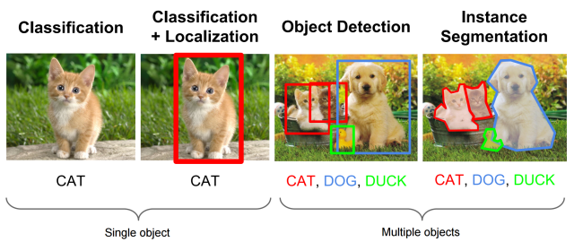

## 机器视觉目标检测补习贴之R-CNN系列 — R-CNN, Fast R-CNN, Faster R-CNN  
  
  ### 初识目标检测领域，当然先要了解下面这些框架：  
* RCNN  
* Fast RCNN  
* Faster RCNN  
* Yolo  
* SSD  

> 什么是目标检测？  

  
  把存在的目标从图片中找出来，就是那么简单！
  
在计算机中，传统目标检测方法大致分为如下三步：区域选择，特征提取，分类器分类。  
首先在给定的图像上选择一些候选的区域，然后对这些区域提取特征，最后使用训练的分类器进行分类。下面我们对这三个阶段分别进行介绍。
  
(1) 区域选择  
  
这一步是为了对目标的位置进行定位。由于目标可能出现在图像的任何位置，而且目标的大小、长宽比例也不确定，所以最初采用滑动窗口的策略对整幅图像进行遍历，而且需要设置不同的尺度，不同的长宽比。这种穷举的策略虽然包含了目标所有可能出现的位置，但是缺点也是显而易见的：时间复杂度太高，产生冗余窗口太多，这也严重影响后续特征提取和分类的速度和性能。（实际上由于受到时间复杂度的问题，滑动窗口的长宽比一般都是固定的设置几个，所以对于长宽比浮动较大的多类别目标检测，即便是滑动窗口遍历也不能得到很好的区域）  

(2) 特征提取  

由于目标的形态多样性，光照变化多样性，背景多样性等因素使得设计一个鲁棒的特征并不是那么容易。然而提取特征的好坏直接影响到分类的准确性。（这个阶段常用的特征有SIFT、HOG等）  

(3) 分类器  

主要有SVM, Adaboost等。  
 

总结：传统目标检测存在的两个主要问题：一个是基于滑动窗口的区域选择策略没有针对性，时间复杂度高，窗口冗余；二是手工设计的特征对于多样性的变化并没有很好的鲁棒性。  
  
    #### 深度学习特别是CNN的出现使得上述第2，3步可以合并在一起做：

## SLIC原理简介及VLFeat代码示例  
1. 原理  

SLIC，即简单线性迭代聚类，是一种简单有效的图像分割方法，其本质是局部空间的K-means聚类。

2. 方法：  

1）给定超像素个数，初始化聚类中心（按照regionSize均匀分割为grid tile，一般选取grid tile的中心为聚类中心）； 
2）将初始聚类中心在其n×n邻域内微调（一般n=3即可），将聚类中心移到邻域内梯度最小的地方，这样是为了防止聚类中心落在边界上； 
3）每个grid tile（regionSize×regionSize的方格）内根据各点到聚类中心的距离进行K-means聚类； 
4）计算新的聚类中心与之前聚类中心的L1距离，根据阈值判断算法是否收敛。

3. VLFeat之vl_slic

MATLAB API：SLIC详细介绍参见VLFeat官网

SEGMENTS = VL_SLIC(IM, REGIONSIZE, REGULARIZER) 
参数： 
IM： Input image， SINGLE array with two or three dimensions. The third dimension is arbitrary, but it is usually three for RGB or LAB images 
REGIONSIZE ：is the starting size of the superpixels； 
REGULARIZER： is the trades-off appearance for spatial regularity when clustering (a larger value results in more spatial regularization). 
SEGMENTS is a UINT32 array containing the superpixel identifier for each image pixel.
示例：代码引自：http://blog.csdn.net/yeyang911/article/details/39156817
```matlab
function slicTest( IMG ,SIZE,RATE)

I =  vl_rgb2xyz(imread(IMG));
II =  (imread(IMG));
im=II;
size(im)

I_single = single(I);
segments = vl_slic(I_single, SIZE, RATE) ;
[sx,sy]=vl_grad(double(segments), 'type', 'forward') ;
s = find(sx | sy) ;
size(find(sx | sy))
imp = II ;
imp([s s+numel(im(:,:,1)) s+2*numel(im(:,:,1))]) = 0 ;

o = imp;
imshow(o);

end
```
运行结果:  


